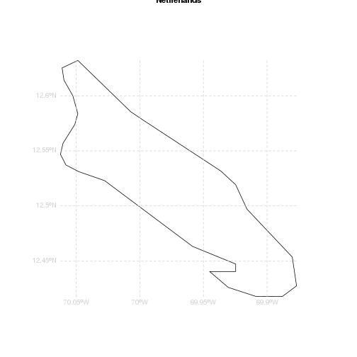
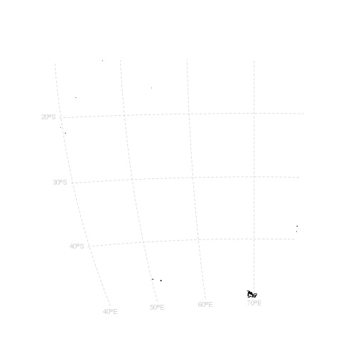
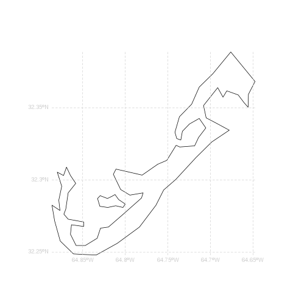
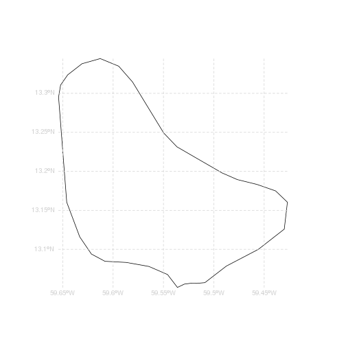
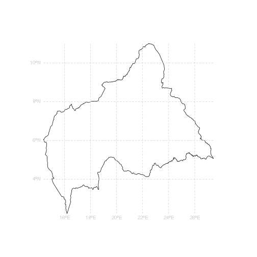
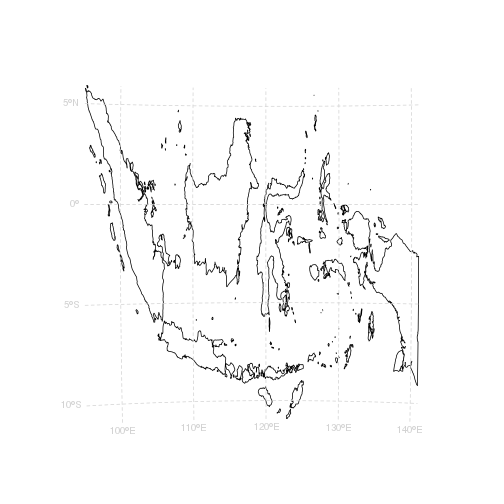
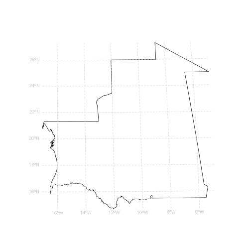
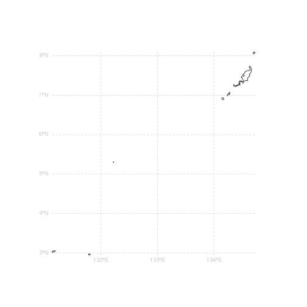
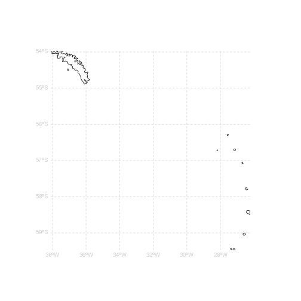

<!-- README.md is generated from README.Rmd. Please edit that file -->


```r
f <- "http://www.naturalearthdata.com/http//www.naturalearthdata.com/download/10m/cultural/ne_10m_admin_0_countries.zip"
download.file(f, basename(f), mode = "wb")
unzip(basename(f))
```


```r
library(rgdal)
library(raster)
ctry <- readOGR(".", "ne_10m_admin_0_countries")
#> OGR data source with driver: ESRI Shapefile 
#> Source: ".", layer: "ne_10m_admin_0_countries"
#> with 255 features
#> It has 65 fields

fx <- function(x) (xmin(x) + xmax(x))/2
fy <- function(x) (ymin(x) + ymax(x))/2
projlocal <- function(x) {
  ## just the "middle" in longlat for now
  sprintf("+proj=laea +ellps=WGS84 +lon_0=%s +lat_0=f", fx(x), fy(x) )
}
```


```r
ef <- 1.4
op <- par(mar = rep(0, 4), xpd = NA, cex = 0.8)
for (irow in seq(nrow(ctry))) {
  ## project to local based on first piece encountered
  x <- try(spTransform(ctry[irow, ], projlocal(disaggregate(ctry[irow, ])[1L, ])))
  if (inherits(x, "try-error")) {
    print(sprintf("ba bom %s", ctry$SOVEREIGNT[irow]))
    } else {
  plot(extent(ctry[irow, ]) * ef, type = "n", axes = FALSE, xlab = "", ylab = "", main = x$SOVEREIGNT[irow])
  plot(ctry[irow, ], add = TRUE); llgridlines(ctry[irow, ], col = "lightgrey", lty = 2)
  plot(extent(x) * ef, type = "n", axes = FALSE, xlab = "", ylab = "")
plot(x, add = TRUE); try(llgridlines(x, col = "lightgrey", lty = 2))
}}
```


